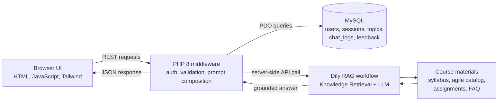

# Capstone GPT


Capstone GPT is a full-stack retrieval-augmented generation assistant for Miami University Senior Design students. It helps students ask course-specific questions about project ideas, working agreements, sprint planning, technical standards, retrospectives, and expo preparation, then grounds responses in course materials instead of generic AI output.

The project demonstrates secure AI application design in a compact PHP/MySQL stack. Browser requests go through PHP middleware, the Dify API key stays server-side, user input is validated before database or AI calls, passwords are hashed with bcrypt, sessions use 256-bit tokens, and instructor-facing analytics are separated from the student chat experience.

## Architecture



## What I Built

- PHP 8 REST middleware with endpoints for auth, chat, profile, conversation history, feedback, analytics, and CSV export.
- MySQL schema with normalized tables for users, sessions, course topics, chat logs, and per-response feedback.
- Vanilla JavaScript and Tailwind frontend for login, chat, profile editing, conversation history, transparency messaging, and an instructor dashboard.
- Dify-powered RAG workflow that retrieves from uploaded course documents before the LLM generates an answer.
- Topic-aware prompt composition and profile context injection so answers can adapt to a student's major, project idea, teammates, and course section.
- Feedback and analytics loop so instructors can inspect question volume, topic distribution, response ratings, conversation depth, and exported logs.

## Security Decisions

- The Dify API key is never exposed to client-side JavaScript; all AI calls route through PHP middleware.
- Passwords are stored with PHP's `password_hash()` using `PASSWORD_DEFAULT`.
- Sessions are 64-character hex tokens generated from `random_bytes(32)`.
- API endpoints enforce HTTP methods, parse JSON centrally, validate required fields, and return structured JSON errors.
- Chat logs, feedback, and CSV export are treated as sensitive operational data and should not be published with the repository.
- `api/config.local.php` is ignored by Git; use `api/config.local.example.php` as the template for local setup.

## Screenshot

Screenshot placeholder lives in [docs/screenshots/README.md](docs/screenshots/README.md). A real UI screenshot should be added only after confirming that the local database, chat history, browser storage, and Dify workspace contain no private data.

## Setup

### Prerequisites

- PHP 8.0 or newer with `pdo_mysql` and `curl`
- MySQL 8.0 or newer
- Git
- A Dify Cloud chat app API key

### 1. Clone

```bash
git clone https://github.com/zariffidachowdhury/capstone-gpt.git
cd capstone-gpt
```

### 2. Configure

```bash
cp api/config.local.example.php api/config.local.php
```

Edit `api/config.local.php` with your local MySQL credentials and Dify API key.

### 3. Create The Database

```bash
mysql -u root < sql/001_schema.sql
mysql -u root capstone_gpt < sql/002_feedback.sql
mysql -u root capstone_gpt < sql/003_users.sql
mysql -u root capstone_gpt < sql/004_sessions.sql
mysql -u root capstone_gpt < sql/005_topics_update.sql
```

### 4. Run Locally

```bash
php -S localhost:8080
```

Open `http://localhost:8080/public/login.html`.

### 5. Smoke Test

1. Create a local account with a test email and 8+ character password.
2. Fill out the profile page with non-sensitive sample data.
3. Ask a question from the chat page.
4. Submit thumbs-up or thumbs-down feedback.
5. Open `public/admin.html` and confirm analytics update.
6. Export CSV only from local test data.

## Documentation

- [System Architecture](wiki/System-Architecture.md)
- [Getting Started](wiki/Getting-Started.md)
- [Database Schema](wiki/Database-Schema.md)
- [Testing](wiki/Testing.md)
- [Constraints and Future Work](wiki/Constraints-and-Future-Work.md)

## License

MIT License. See [LICENSE](LICENSE).
