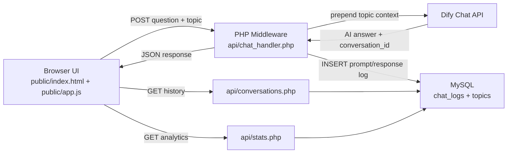

# Capstone GPT System Architecture

## Overview
Capstone GPT is a localhost prototype built around a simple but defensible architecture: a browser-based chat client talks to PHP middleware, the middleware calls Dify for AI responses, and successful exchanges are logged in MySQL for later analysis.

## Core Components
- `public/index.html` and `public/app.js`: student-facing chat interface with topic selection, suggested prompts, retry handling, and conversation history.
- `api/chat_handler.php`: receives frontend requests, applies topic-aware routing, forwards prompts to Dify, and logs responses.
- `api/conversations.php`: returns grouped conversation history for the current scaffolded student user.
- `api/stats.php`: returns usage analytics for professor-facing review.
- `api/config.local.php`: stores the real Dify key server-side and is excluded from version control.
- `sql/001_schema.sql`: defines the `topics` and `chat_logs` tables used by the prototype.

## Request and Data Flow

## Data Responsibilities
- Frontend state:
  - current message draft
  - selected topic
  - active `conversationId`
  - rendered history and retry state
- Middleware responsibilities:
  - validate requests
  - keep secrets on the server
  - call Dify with the current user and optional topic prefix
  - log successful prompt/response pairs
- Database responsibilities:
  - store chat transcripts in `chat_logs`
  - store the canonical course topics in `topics`

## Security and Constraint Notes
- The Dify API key is never exposed in JavaScript.
- CAS remains scaffolded as `test_student` until a future authentication integration replaces it.
- The prototype intentionally uses vanilla JS and Tailwind Play CDN to keep the stack simple and easy to demo on localhost.

## Diagramming Notes for Presentation
- The key architectural message is that the browser never calls Dify directly.
- PHP acts as the control point for validation, prompt shaping, and logging.
- MySQL enables both retrospective history and professor-facing analytics without changing the student experience.
