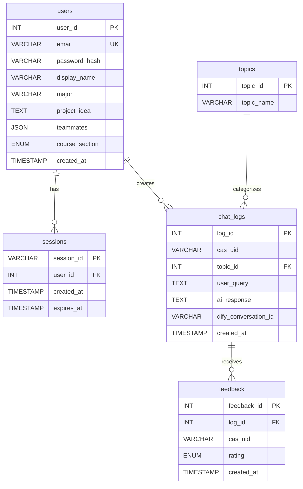

# Database Schema

## Overview

The database name is `capstone_gpt`. All tables use InnoDB defaults and `utf8mb4` character set. Migrations live in `sql/` and must be applied in numeric order.

## Migration Order

| File | Creates |
|------|---------|
| `sql/001_schema.sql` | `topics`, `chat_logs` (with seed topics) |
| `sql/002_feedback.sql` | `feedback` (with FK to `chat_logs`) |
| `sql/003_users.sql` | `users` |
| `sql/004_sessions.sql` | `sessions` (with FK to `users`) |
| `sql/005_topics_update.sql` | Updates topic names to CSE 448/449 categories |

## Entity Relationship



## Table Details

### `users`

Identity and profile. Each row represents one student.

| Column | Type | Notes |
|--------|------|-------|
| `user_id` | INT AUTO_INCREMENT | Primary key |
| `email` | VARCHAR(255) UNIQUE | Login identifier; lowercased on insert |
| `password_hash` | VARCHAR(255) | bcrypt via `password_hash()` |
| `display_name` | VARCHAR(100) | Shown in the chat header |
| `major` | VARCHAR(100) | Optional. Sent to the AI as profile context |
| `project_idea` | TEXT | Optional. Sent to the AI as profile context |
| `teammates` | JSON | Array of strings. Sent to the AI as profile context |
| `course_section` | ENUM('CSE448','CSE449') | Defaults to `CSE449` |
| `created_at` | TIMESTAMP | DEFAULT CURRENT_TIMESTAMP |

### `sessions`

Bearer-token storage for authenticated requests.

| Column | Type | Notes |
|--------|------|-------|
| `session_id` | VARCHAR(64) PRIMARY KEY | 64-char hex from `bin2hex(random_bytes(32))` |
| `user_id` | INT NOT NULL | FK to `users.user_id`, ON DELETE CASCADE |
| `created_at` | TIMESTAMP | Issued time |
| `expires_at` | TIMESTAMP NOT NULL | 7 days after `created_at` by default |

Indexes: `idx_sessions_user_id`, `idx_sessions_expires_at`. Expired rows are deleted opportunistically when a new session is created.

### `topics`

Course-specific categories used to scope queries before they reach the AI.

| Column | Type | Notes |
|--------|------|-------|
| `topic_id` | INT AUTO_INCREMENT | Primary key |
| `topic_name` | VARCHAR(100) NOT NULL | Display name |

After running `005_topics_update.sql`, the table contains the 10 CSE 448/449 categories: GitLab & Code Management, Agile Practices & Scrum, Working Agreement, Sprint Planning & Backlog, ABET Outcomes, General Course Help, Project Ideas & Selection, Technical Standards, Expo & Video Prep, Retrospectives & Reflection.

### `chat_logs`

Every successful chat exchange. The middleware writes one row per Dify response.

| Column | Type | Notes |
|--------|------|-------|
| `log_id` | INT AUTO_INCREMENT | Primary key. Returned to the client for feedback attachment |
| `cas_uid` | VARCHAR(100) | Either the user_id (as a string) or `test_student` for unauthenticated requests |
| `topic_id` | INT NULLABLE | FK to `topics.topic_id` |
| `user_query` | TEXT NOT NULL | Original user message (without topic prefix) |
| `ai_response` | TEXT | Dify answer |
| `dify_conversation_id` | VARCHAR(255) | Returned by Dify, used to thread multi-turn chats |
| `created_at` | TIMESTAMP | DEFAULT CURRENT_TIMESTAMP |

### `feedback`

Per-response thumbs ratings.

| Column | Type | Notes |
|--------|------|-------|
| `feedback_id` | INT AUTO_INCREMENT | Primary key |
| `log_id` | INT NOT NULL | FK to `chat_logs.log_id`, ON DELETE CASCADE |
| `cas_uid` | VARCHAR(100) | Same convention as chat_logs |
| `rating` | ENUM('up','down') | Thumbs |
| `created_at` | TIMESTAMP | DEFAULT CURRENT_TIMESTAMP |

UNIQUE KEY `uniq_feedback_log_user (log_id, cas_uid)` prevents duplicate ratings.

## Backup and Reset

To wipe and rebuild the database during development:

```bash
mysql -u root -e "DROP DATABASE IF EXISTS capstone_gpt;"
mysql -u root < sql/001_schema.sql
mysql -u root capstone_gpt < sql/002_feedback.sql
mysql -u root capstone_gpt < sql/003_users.sql
mysql -u root capstone_gpt < sql/004_sessions.sql
mysql -u root capstone_gpt < sql/005_topics_update.sql
```

## Migration Strategy

Every schema change should be added as a new numbered file in `sql/`. Existing migrations should not be edited. This keeps the migration history append-only and reproducible.
