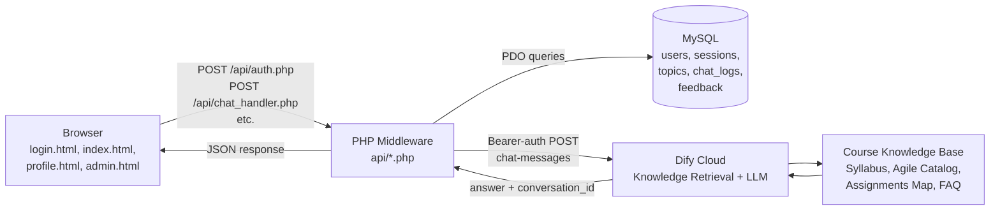
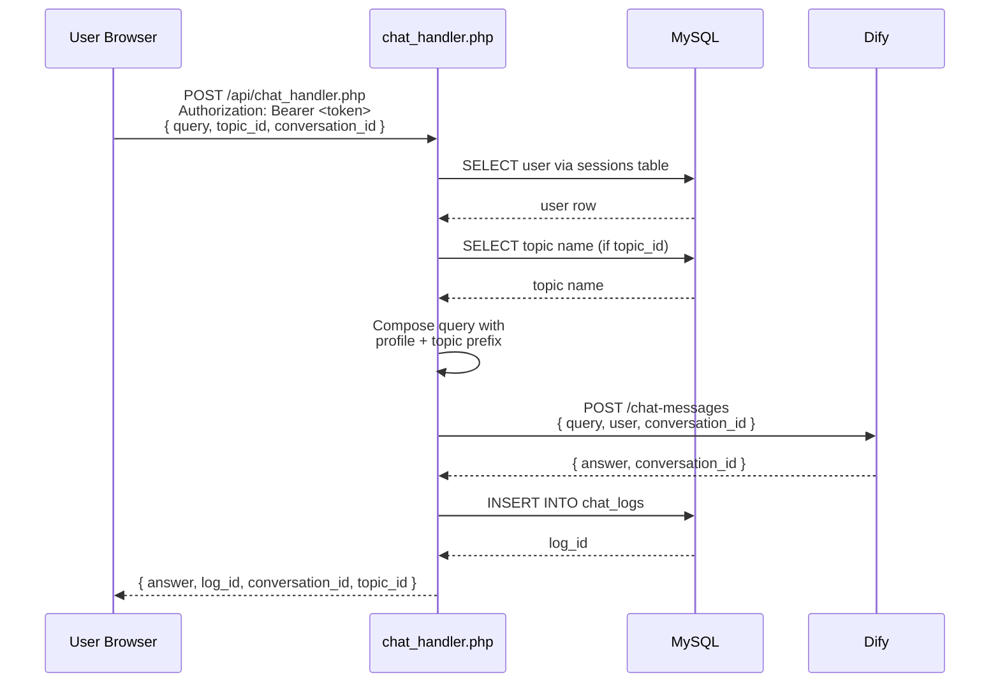

# System Architecture

## High-Level Diagram

## Component Responsibilities

### Frontend (Browser)
- **Page rendering** — Vanilla HTML, Tailwind utility classes, custom design tokens.
- **State management** — `localStorage` holds the session token and a cached user profile. No client-side framework.
- **Authentication flow** — `login.html` handles register and login, persists the session token, redirects to `index.html`. All authenticated pages validate the token on load and redirect back to login on failure.
- **Chat interaction** — `app.js` manages the message history, topic selection, suggested prompts, retry handling, and feedback submission.

### PHP Middleware (`api/*.php`)
- **Request validation** — Each endpoint enforces HTTP method, parses JSON, and validates required fields.
- **Authentication** — Bearer-token validation via the `sessions` table. Cached per-request to avoid duplicate lookups.
- **Topic context** — When a topic is selected, the topic name is prepended to the query.
- **Profile context** — When a user is authenticated, the profile (display name, major, project idea, teammates, course section) is prepended as a structured block before the user's query.
- **Dify proxy** — Forwards the composed query to the Dify chat-messages endpoint. The Dify API key never leaves the server.
- **Logging** — Successful exchanges are inserted into `chat_logs` with the user identifier, topic, prompt, response, and Dify conversation ID.
- **Analytics** — `stats.php` aggregates chat logs and feedback into the dashboard payload.
- **Export** — `export.php` streams a CSV of logs and feedback.

### Database (MySQL)
- **Identity** — `users`, `sessions`.
- **Course taxonomy** — `topics` (10 CSE 448/449-specific categories).
- **Activity** — `chat_logs`, `feedback`.

### Dify Cloud
- **Workflow** — `USER INPUT → Knowledge Retrieval → LLM → ANSWER`.
- **Knowledge base** — Four uploaded course documents (syllabus, agile catalog, assignments map, FAQ).
- **System prompt** — Configured to act as a CSE 448/449 assistant grounded in course materials.

## Request Flow: Authenticated Chat

## Security Boundaries

- **Trust boundary** — Browser is untrusted. All authentication happens server-side.
- **Secrets** — Dify API key, MySQL credentials, and any other secrets live in `api/config.local.php`, which is gitignored.
- **Tokens** — Session tokens are 64-character hex strings (256 bits of entropy from `random_bytes(32)`).
- **Passwords** — Stored as bcrypt hashes via `password_hash()` with `PASSWORD_DEFAULT`. Never logged.
- **CORS** — Permissive (`*`) for development; tighten before production.

## Data Responsibilities

| Layer | Owns |
|-------|------|
| Frontend | Draft message, current topic, session token, cached profile, rendered history |
| Middleware | Request validation, auth, prompt composition, logging, analytics computation |
| Database | Identity, taxonomy, transcript, feedback |
| Dify | Knowledge retrieval, LLM generation, conversation memory |
